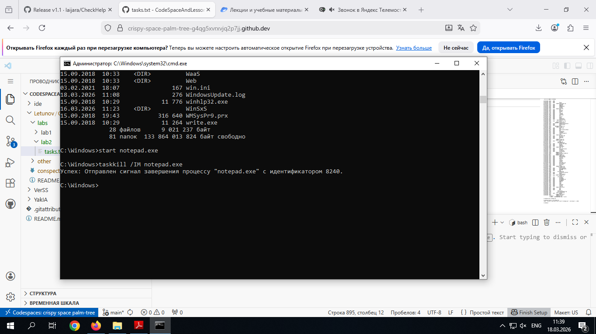

# Лабораторная работа № 2: Управление памятью и процессами в ОС Windows

**Цель работы:** Практическое знакомство с управлением вводом/выводом в операционных системах Windows и кэширования операций ввода/вывода.

## План проведения занятия
1. Ознакомиться с краткими теоретическими сведениями.
2. Ознакомиться с назначением и основными функциями Диспетчера задач Windows.
3. Приобрести навыки применения командной строки Windows. Научиться запускать, останавливать и проверять работу процессов.
4. Сделать выводы о взаимосвязи запущенных процессов и оперативной памятью компьютера.
5. Подготовить отчет для преподавателя о выполнении лабораторной работы и записать его в папку «Выполнение».

---

## Краткие теоретические сведения

Необходимость обеспечить программам возможность осуществлять обмен данными с внешними устройствами и при этом не включать в каждую двоичную программу соответствующий двоичный код, осуществляющий собственно управление устройствами ввода/вывода, привела разработчиков к созданию системного программного обеспечения и, в частности, самих операционных систем.

Программирование задач управления вводом/выводом является наиболее сложным и трудоемким, требующим очень высокой квалификации. Поэтому код, позволяющий осуществлять операции ввода/вывода, стали оформлять в виде системных библиотечных процедур; потом его стали включать не в системы программирования, а в операционную систему с тем, чтобы в каждую отдельно взятую программу его не вставлять, а только позволить обращаться к такому коду. 

Системы программирования стали генерировать обращения к этому системному коду ввода/вывода и осуществлять только подготовку к собственно операциям ввода/вывода, то есть автоматизировать преобразование данных к соответствующему формату, понятному устройствам, избавляя прикладных программистов от этой сложной и трудоемкой работы. Другими словами, системы программирования вставляют в машинный код необходимые библиотечные подпрограммы ввода/вывода и обращения к тем системным программным модулям, которые, собственно, и управляют операциями обмена между оперативной памятью и внешними устройствами. [2]

Таким образом, **управление вводом/выводом** — это одна из основных функций любой ОС [2]. Одним из средств управления вводом/выводом, а также инструментом управления памятью является **Диспетчер задач Windows**. Он отображает приложения, процессы и службы, которые в текущий момент запущены на компьютере. С его помощью можно контролировать производительность компьютера или завершать работу приложений, которые не отвечают.

При наличии подключения к сети можно также просматривать состояние сети и параметры ее работы. Если к компьютеру подключились несколько пользователей, можно увидеть их имена, какие задачи они выполняют, а также отправить им сообщение. Также управлять процессами можно и «вручную» при помощи командной строки [1][2].

### Команды Windows для работы с процессами:
* `at` — запуск программ в заданное время;
* `Schtasks` — настраивает выполнение команд по расписанию;
* `Start` — запускает определенную программу или команду в отдельном окне;
* `Taskkill` — завершает процесс;
* `Tasklist` — выводит информацию о работающих процессах.

Для получения более подробной информации можно использовать центр справки и поддержки или команду `help` (например: `help at`).
* `command.com` — запуск командной оболочки MS-DOS;
* `cmd.exe` — запуск командной оболочки Windows.

---

## Ход работы

### Задание 1. Работа с Диспетчером задач Windows

1. Запустите Windows;
2. Запуск диспетчера задач можно осуществить двумя способами:
   * Нажатием сочетания клавиш `Ctrl+Alt+Del`. Появится меню, в котором курсором следует выбрать пункт «Диспетчер задач».
   * Переведите курсор на область с показаниями системной даты и времени (в трее) и нажмите правый клик. В выведенном меню следует выбрать «Диспетчер задач».
3. В диспетчере задач есть 6 вкладок:
   * **Приложения:** отображает список запущенных задач (программ), выполняющихся в настоящий момент не в фоновом режиме, а также отображает их состояние. В данном окне можно снять задачу, переключиться между задачами и запустить новую задачу при помощи соответствующих кнопок.
   * **Процессы:** отображает список запущенных процессов, имя пользователя, запустившего процесс, загрузку центрального процессора в процентном соотношении, а также объем памяти, используемой для выполнения процесса. Присутствует возможность отображать процессы всех пользователей либо принудительно завершать процесс. *(Процесс — выполнение пассивных инструкций компьютерной программы на процессоре ЭВМ).*
   * **Службы:** показывает, какие службы запущены на компьютере. *(Службы — приложения, автоматически запускаемые системой при запуске ОС Windows и выполняющиеся вне зависимости от статуса пользователя).*
   * **Быстродействие:** отображает в графическом режиме загрузку процессора, а также хронологию использования физической памяти компьютера. Очень эффективным инструментом наблюдения является «Монитор ресурсов». Подробное изучение инструмента произвести самостоятельно.
   * **Сеть:** отображает подключенные сетевые адаптеры, а также сетевую активность.
   * **Пользователи:** отображает список подключенных пользователей.
4. Потренируйтесь в завершении и повторном запуске процессов.
5. Разберите мониторинг загрузки и использование памяти.
6. Попытайтесь запустить новые процессы при помощи диспетчера, для этого можно использовать команды: `cmd`, `msconfig`.

## Отчет о выполнении лабораторной работы

### Задание 2. Командная строка Windows

**1. Запуск командной строки**
Командная строка (cmd.exe) была запущена стандартными средствами ОС Windows.


**2. Работа с основными командами**
В ходе работы были проверены базовые утилиты для управления процессами:
* `Schtasks` — настройка и просмотр задач по расписанию;
* `Start` — запуск программы в новом окне;
* `Taskkill` — принудительное завершение процесса;
* `Tasklist` — вывод таблицы активных процессов.

**3. Навигация по каталогам**
Выполнен переход в корневой каталог и папку Windows, просмотрено содержимое:
```cmd
cd \
cd windows
dir
```


**4. Управление процессом «Блокнот» (Notepad)**
Запуск Блокнота из командной строки:
```cmd
C:\Windows> start notepad.exe
```
Отслеживание процесса в списке (для удобства можно использовать фильтр find):
```cmd
C:\Windows> tasklist | find "notepad.exe"
```
Завершение процесса:
```cmd
C:\Windows> taskkill /IM notepad.exe /F
```


**5. Поиск и запуск программы WordPad**
Программа WordPad в Windows обычно запускается через исполняемый файл `write.exe` (расположенный в папке Windows) или системный псевдоним `wordpad.exe`.
Запуск осуществлен командой:
```cmd
C:\Windows> start write.exe
```


---

### Задание 3. Самостоятельное задание

**1. Отслеживание процесса explorer.exe**
Процесс `explorer.exe` (Проводник Windows) отвечает за графическую оболочку системы: рабочий стол, панель задач, меню «Пуск» и файловый менеджер.
Отслеживание процесса через командную строку:
```cmd
tasklist | find "explorer.exe"
```


**2. Управление процессом через Диспетчер задач**
* **Завершение:** Во вкладке «Процессы» (или «Подробности») был найден процесс «Проводник» (`explorer.exe`). После нажатия кнопки «Снять задачу» (или End Task) графический интерфейс (рабочий стол и панель задач) исчез, на экране осталось только окно Диспетчера задач.
* **Повторный запуск:** В верхнем меню Диспетчера задач выбрано `Файл` -> `Запустить новую задачу` (Run new task). В появившемся окне введено `explorer.exe` и нажато «ОК». Графическая оболочка успешно перезапустилась.


**3. Управление процессом через Командную строку**
Завершение процесса (параметр `/F` для принудительного закрытия, `/IM` для указания имени образа):
```cmd
taskkill /F /IM explorer.exe
```
Повторный запуск оболочки:
```cmd
start explorer.exe
```

